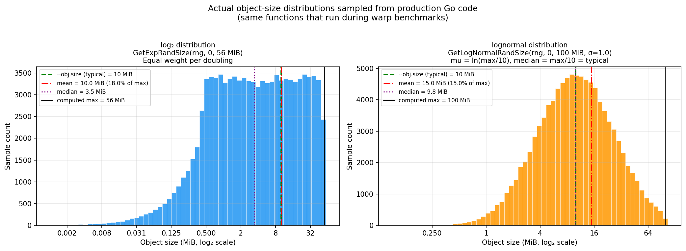

# warp-replay

**warp-replay** is a fork of [MinIO warp](https://github.com/minio/warp), the S3 benchmarking
tool. It adds several capabilities on top of upstream warp:

1. **Workload replay** — replay any prior warp trace (`.csv.zst`) against a new target, or replay
   traces produced by other tools.
2. **Streaming per-transaction log** (`--full`) — write a live, zstandard-compressed per-operation
   CSV log during every benchmark run, enabling precise post-hoc analysis. Unlike the upstream
   in-memory `--full` PR (where RAM usage grows with every operation recorded), **warp-replay
   streams directly to disk and uses only a few MB of RAM regardless of run duration or
   concurrency level**.
3. **Parquet benchmark** (`warp parquet`) — first Parquet-native benchmark in any warp variant;
   exercises the three-phase AI/ML access pattern: one-time footer range GET + cache → parallel
   row-group byte-range GETs (one HTTP request per row group, each recorded individually in the
   op-log). Supports random-without-replacement and sequential (`--rg-sequential`) RG selection.
   See [docs/README_PARQUET.md](docs/README_PARQUET.md).
4. **h2c transport** (`--h2c`) — HTTP/2 cleartext (prior-knowledge) for servers that speak h2c
   natively (e.g. s3-ultra), with a multi-connection pool and configurable stream window sizes.

---

## Documentation

| Document | Description |
|----------|-------------|
| [docs/README-Upstream.md](docs/README-Upstream.md) | Full upstream warp documentation (benchmarks, configuration, analysis, distributed mode, InfluxDB, …) |
| [docs/README_PARQUET.md](docs/README_PARQUET.md) | Parquet benchmark (`warp parquet`) — concurrency model, op-log trace format, row-group selection modes, DLRM test results |
| [docs/README_H2C.md](docs/README_H2C.md) | h2c transport (`--h2c`) — HTTP/2 cleartext with multi-connection pool and stream window tuning |
| [docs/README_ICEBERG.md](docs/README_ICEBERG.md) | Iceberg REST catalog benchmarks (`iceberg catalog-read`, `catalog-commits`, `catalog-mixed`, `sustained`) |
| [docs/Warp-streaming-log-Design.md](docs/Warp-streaming-log-Design.md) | Design notes for the streaming log writer |
| [scripts/](scripts/) | Convenience run scripts for common benchmark configurations |
| [CHANGELOG.md](CHANGELOG.md) | Release history and version notes |

---

## Building

```bash
make           # build the warp binary (injects version/commit info)
make build     # same as above
sudo make install              # install to /usr/local/bin
make install DESTDIR=$HOME/.local/bin  # install to user dir
make test      # run tests
make clean     # remove built binary

# Quick dev build without version info
go build -o warp .
```

Requires Go 1.21+.

---

## New Features in warp-replay

### Parquet Benchmark (`parquet`) — *v1.4.1-replay.2*

Benchmarks the full AI/ML Parquet three-phase I/O access pattern against any S3-compatible
object store:

1. **Footer range GET** — byte-range GET of the last `--footer-size` bytes.
2. **Footer parse** — decode the Thrift CompactProtocol `FileMetaData` to extract
   row-group offsets. This is a live correctness check: a server that returns
   garbage bytes for a range request will fail here.
3. **Row-group GETs** — `--rg-reads` parallel byte-range GETs at the real
   row-group offsets from step 2.

Objects are synthetically generated with real PAR1 magic and a valid Thrift-encoded
footer — no external Parquet library required.

```bash
warp parquet --host localhost:9000 --access-key minioadmin --secret-key minioadmin \\
  --bucket parquet-bench --objects 100 --obj.size 128MiB \\
  --row-groups 10 --rg-size 8MiB --footer-size 128KiB \\
  --rg-reads 2 --concurrent 8 --duration 2m
```

See [docs/README_PARQUET.md](docs/README_PARQUET.md) for the full flag reference,
testing methodology, and worked examples.

### h2c Transport (`--h2c`) — *v1.4.1-replay.2*

Adds HTTP/2 cleartext (h2c, prior-knowledge) transport to every benchmark command.
Useful for servers that speak h2c natively (such as s3-ultra) — warp now exercises
the same protocol path as production AI/ML clients without TLS overhead.

```bash
# Force h2c — server must support prior-knowledge HTTP/2
warp get --host=localhost:9000 --access-key=minioadmin --secret-key=minioadmin \
    --h2c --concurrent 64

# Explicit multi-connection pool (4 TCP sockets × N streams each)
warp parquet --host=localhost:9000 --access-key=minioadmin --secret-key=minioadmin \
    --h2c --h2c-conns 4 --h2c-window-mib 16 --obj.size 128MiB --concurrent 64
```

| Flag | Default | Description |
|------|---------|-------------|
| `--h2c` | false | HTTP/2 cleartext. Overrides `--tls`/`--ktls`. |
| `--h2c-conns` | 0 (auto) | TCP connections. `0` = HTTP/1.1 below 64c, `ceil(c/32)` above. Set `≥1` to force. |
| `--h2c-window-mib` | 0 (→ 4 MiB) | Per-stream receive window. Set ≥ 2× largest object size. |

See [docs/README_H2C.md](docs/README_H2C.md) for full details and tuning guidance.

### Workload Replay (`replay`)

```bash
warp replay --file=warp-put-2026-04-07[162451]-abcd.csv.zst \
    --bucket=my-bucket \
    --host=s3target:9000 \
    --access-key=mykey \
    --secret-key=mysecret
```

Reads every operation recorded in a `.csv.zst` trace file and replays it against
the specified S3 target. Object host/path mappings can be remapped via an optional
YAML config (`--config`).

**Use cases:**
- Reproduce a production workload exactly against a new cluster or storage tier.
- Replay workloads generated by other tools that produce warp-compatible trace files.
- The [s3dlio](https://github.com/russfellows/s3dlio) library can emit warp-format
  traces, making any s3dlio-based workload replayable via warp-replay.

Replay also supports `--log-warp-ops` to record the replayed operations into a new
`.csv.zst` trace for further analysis.

### Full Per-Transaction Log (`--full`)

Adding `--full` to any benchmark command writes **both** output files:

| File | Contents |
|------|----------|
| `<benchdata>.trace.tsv.zst` | Every individual request — one row per operation, zstandard-compressed TSV |
| `<benchdata>.summary.tsv` | Aggregated per-second summary — plain (uncompressed) TSV, one row per second per op type |

The summary file is always written; the trace file requires `--full`.

```bash
warp put --host=... --full
warp run --full benchmark.yaml
```

> **Streaming, not in-memory:** A `--full` implementation has been submitted as a PR to
> upstream warp, but that implementation accumulates every operation record in RAM — memory
> usage grows linearly with the number of operations and can become very large on long or
> high-concurrency runs. warp-replay's implementation is fundamentally different: operations
> are streamed through a background goroutine directly to a zstd-compressed file on disk.
> **RAM overhead is constant at a few MB, regardless of run duration or operation count.**
> There is no practical limit on run length when using `--full` with warp-replay.

---

## Realistic Object Size Distribution (`--obj.randsize`)

Two random-size distributions are available, selected by flag. In both cases
**`--obj.size` specifies the _typical_ object size** — the value a user would
naturally think of as "average" — and warp derives the internal maximum automatically.
Use the `min,max` two-value form (e.g. `--obj.size=1MiB,200MiB`) to set bounds
explicitly if you need precise control.

### log₂ distribution (`--obj.randsize` / `--obj.rand-log2`)

Samples uniformly in log₂-space: every doubling of the size range gets equal
probability weight, producing a right-skewed distribution with a long tail.

- **`--obj.size`** = target **average** (mean)
- Internal max = `--obj.size ÷ 0.179` (~5.6×)
- Observed mean ≈ 18% of internal max
- Median ≈ 35% of mean (many small objects, long tail of large ones)

### lognormal distribution (`--obj.rand-logn`)

A bell curve in log-space — the standard statistical model for real-world file
system and object store size distributions.

- **`--obj.size`** = target **median**
- Internal max = `--obj.size × 10`
- Observed median ≈ `--obj.size` (by construction)
- Observed mean ≈ 150% of `--obj.size` (lognormal mean > median due to right tail)
- Default σ=1.0 spans ~9 doublings at 3σ

Both distributions were sampled from the actual production Go functions
(`GetExpRandSize` / `GetLogNormalRandSize`) using 100,000 samples each:



*100,000 samples from real Go code, `--obj.size=10 MiB`. Left: log₂ — equal count per
doubling, continuous ramp, mean=10 MiB. Right: lognormal (σ=1.0) — bell curve in
log-space, median=10 MiB, mean≈15 MiB.*

### Tuning the spread

Three flags control random-size behaviour:

| Flag | Distribution | `--obj.size` means | Backward compat? |
|------|--------------|--------------------|-----------------|
| `--obj.randsize` | log₂ | target average | **Yes** — unchanged |
| `--obj.rand-log2` | log₂ | target average | Yes |
| `--obj.rand-logn` | Lognormal | target median | — |

`--obj.randsize.sigma` applies only to `--obj.rand-logn` and controls the log-space standard
deviation (default **1.0**, ~9 doublings of spread):

| `--obj.randsize.sigma` | Spread | Typical use |
|------------------------|--------|-------------|
| `0.75` | Narrow — ~6 doublings | Focused, same-tier stress test |
| `1.0` | Default — ~9 doublings | General purpose |
| `1.5` | Wide — ~13 doublings | Archival / mixed-tier workloads |

```bash
# log₂: --obj.size is the target average; warp sets max internally (~5.6×)
warp put --obj.size=10MiB --obj.randsize

# log₂ explicit alias
warp put --obj.size=10MiB --obj.rand-log2

# lognormal: --obj.size is the target median; warp sets max internally (×10)
warp put --obj.size=10MiB --obj.rand-logn

# lognormal with tighter spread (σ=0.75)
warp put --obj.size=10MiB --obj.rand-logn --obj.randsize.sigma=0.75

# Explicit bounds (power-user override — obj.size is exact min,max, no transformation)
warp put --obj.size=1MiB,200MiB --obj.rand-logn
```

YAML config equivalents: `obj.rand-size` (log₂), `obj.rand-log-2` (log₂), `obj.rand-log-n` (lognormal), `obj.rand-size-sigma`.

### Regenerating the distribution plot

The plot above is produced from 100,000 samples drawn from the actual Go distribution
functions. To regenerate it after code changes:

```bash
# Sample the real Go functions → TSV
go run ./docs/sample_distributions -n 100000 -typical 10MiB > docs/dist_samples.tsv

# Plot with polars + matplotlib (requires uv)
uv run python docs/plot_actual_distributions.py
```

---

## Analyzing Results

Every warp-replay run produces a **`<benchdata>.summary.tsv`** file — a plain,
uncompressed tab-separated table with one row per second per operation type
(`op`, `start`, `end`, `bps`, `ops_per_sec`, `errors`). This format is
deliberately easy to open in Excel, import into pandas/polars, or feed into
any analysis tool without a decompression step.

When `--full` is also specified, a **`<benchdata>.trace.tsv.zst`** file is
written alongside the summary — one row per individual HTTP request,
zstd-compressed because these files can be large.

### Recommended: polarWarp

> **[polarWarp](https://github.com/russfellows/polarWarp)** is the strongly
> recommended tool for all post-run analysis. It is a high-performance
> Polars-based analyzer that reads both summary TSV and full trace files,
> produces formatted terminal reports, and generates Excel workbooks with
> embedded throughput and I/O-rate charts — orders of magnitude faster than
> the built-in `warp analyze`, with richer output, filtering, and side-by-side
> comparison support.

```bash
# Install polarWarp
pip install polarwarp   # or: https://github.com/russfellows/polarWarp

# Analyze the summary file (always present — no --full needed)
polarwarp warp-put-2026-05-16[120000]-abcd.summary.tsv

# Analyze the full per-request trace (requires --full during the run)
polarwarp warp-put-2026-05-16[120000]-abcd.trace.tsv.zst

# Pass both at once — polarWarp merges summary stats and trace charts
polarwarp warp-put-2026-05-16[120000]-abcd.summary.tsv \
          warp-put-2026-05-16[120000]-abcd.trace.tsv.zst

# Export an Excel workbook with embedded charts
polarwarp --excel warp-put-2026-05-16[120000]-abcd.summary.tsv
```

### Built-in analyzer

The `warp analyze` command is available for quick checks but is significantly
slower on large trace files and produces plain text only:

```bash
# Built-in analyzer — trace file only
warp analyze --full warp-put-2026-05-16[120000]-abcd.trace.tsv.zst
```

### Comparing runs

```bash
warp cmp before.csv.zst after.csv.zst
```

Or use [polarWarp](https://github.com/russfellows/polarWarp) for side-by-side
comparison with statistical significance testing, charts, and Excel export.

---

## All Standard Warp Benchmarks

warp-replay supports every benchmark from upstream warp unchanged:
`get`, `put`, `delete`, `list`, `stat`, `mixed`, `versioned`, `multipart`,
`multipart-put`, `append`, `zip`, `snowball`, `fanout`, `retention`, and
the full Iceberg REST catalog suite — plus the new `parquet` benchmark.

See [docs/README-Upstream.md](docs/README-Upstream.md) for complete documentation
of all benchmarks, configuration options, distributed mode, YAML config files,
InfluxDB integration, and server profiling. For Iceberg-specific details see
[docs/README_ICEBERG.md](docs/README_ICEBERG.md).

---

## Quick Start

```bash
# Clone and build
git clone https://github.com/russfellows/warp-replay.git
cd warp-replay
make

# Run a PUT benchmark — summary TSV is always written;
# add --full to also capture every individual request
./warp put --host=minio:9000 --access-key=minio --secret-key=minio123 \
    --duration=60s --full

# Analyze with polarWarp (strongly recommended)
# https://github.com/russfellows/polarWarp
polarwarp warp-put-*.summary.tsv               # summary report + charts
polarwarp warp-put-*.trace.tsv.zst             # full per-request trace
polarwarp --excel warp-put-*.summary.tsv       # export Excel workbook

# Or with the built-in analyzer (trace file only)
./warp analyze --full warp-put-*.trace.tsv.zst

# Replay the recorded workload against a different target
./warp replay --file=warp-put-*.csv.zst \
    --bucket=test-bucket --host=new-target:9000 \
    --access-key=minio --secret-key=minio123
```

---

## License

AGPL-3.0 — same as upstream warp. All addtions in this fork are © 2026 Signal65 / Futurum Group LLC.
